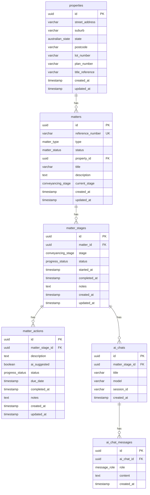

# Legal Agent Flow Demo

An AI-powered legal matter progression agent that guides lawyers through residential conveyancing workflows. Built with Next.js, Vercel AI SDK, Drizzle ORM, Neon PostgreSQL, Langfuse, and Google Gemini.

## Stack

- **Framework:** Next.js 16 (App Router, TypeScript, Tailwind CSS v4)
- **Database:** Neon PostgreSQL (serverless HTTP driver)
- **ORM:** Drizzle ORM
- **AI:** Vercel AI SDK + Google Gemini (free tier)
- **Observability:** Langfuse (tracing, prompt management, evaluations)
- **Linting:** Biome
- **Deployment:** Vercel

## Getting Started

### Prerequisites

- Node.js 18+
- A [Neon](https://neon.tech/) account (free tier)

### Setup

```bash
# Install dependencies
npm install

# Copy env template and add your Neon connection string
cp .env.example .env.local
# Edit .env.local with:
#   DATABASE_URL        - Neon connection string (from console.neon.tech)
#   LANGFUSE_PUBLIC_KEY - Langfuse public key (from project settings)
#   LANGFUSE_SECRET_KEY - Langfuse secret key
#   LANGFUSE_BASEURL    - https://cloud.langfuse.com (or self-hosted URL)
#   GOOGLE_GENERATIVE_AI_API_KEY - Gemini API key (from aistudio.google.com)

# Generate and apply migrations
npm run db:generate
npm run db:migrate

# Seed the database with a sample conveyancing matter
npm run db:seed

# Start the dev server
npm run dev
```

## Database Schema

Six tables model the legal matter lifecycle:

- **properties** -- Physical properties associated with matters
- **matters** -- A legal matter (e.g., residential conveyancing for a specific client)
- **matter_stages** -- The stages a matter progresses through (10 stages for conveyancing)
- **matter_actions** -- Individual tasks within each stage
- **ai_chats** -- Chat sessions between the user and the AI agent
- **ai_chat_messages** -- Individual messages within a chat session



The seed script creates a sample residential conveyancing matter with all 10 stages and 50 actions based on the Australian buyer-side conveyancing workflow.

## Scripts

| Script | Description |
|--------|-------------|
| `npm run dev` | Start dev server (Turbopack) |
| `npm run build` | Production build |
| `npm run lint` | Lint and check formatting (Biome) |
| `npm run lint:fix` | Auto-fix lint and formatting issues |
| `npm run format` | Format all files |
| `npm run db:generate` | Generate migration SQL from schema |
| `npm run db:migrate` | Apply migrations to Neon |
| `npm run db:seed` | Seed database with sample data |
| `npm run db:studio` | Open Drizzle Studio |

## Project Structure

```
src/
  app/
    api/chat/route.ts   # Chat API route (Gemini + Langfuse tracing)
    layout.tsx          # Root layout
    page.tsx            # Home page
    globals.css         # Tailwind v4 styles
  db/
    schema.ts           # Drizzle schema (6 tables, 6 enums, relations)
    index.ts            # Database connection (Neon HTTP driver)
    seed.ts             # Seed script with conveyancing workflow data
  lib/ai/
    telemetry.ts        # Shared telemetry config for AI SDK calls
  instrumentation.ts    # OTel + Langfuse provider registration
drizzle/                # Generated migration SQL (version-controlled)
drizzle.config.ts       # Drizzle Kit configuration
```
