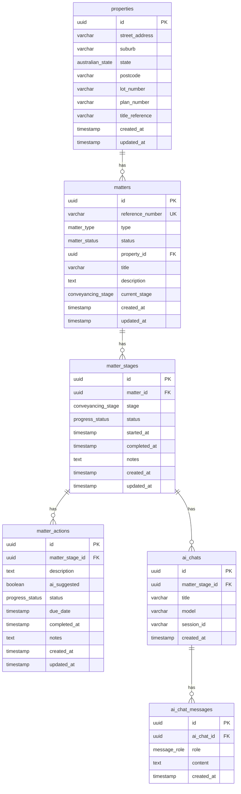
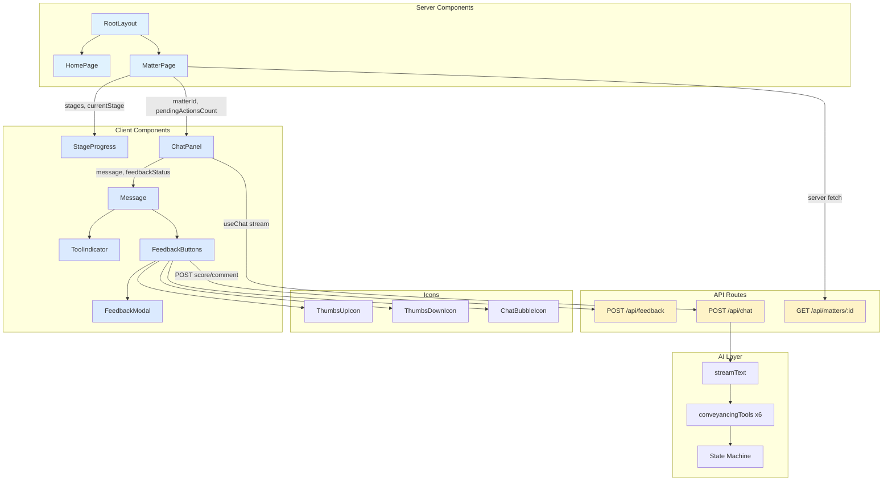

# Legal Agent Flow Demo

An AI-powered legal matter progression agent that guides lawyers through Australian residential conveyancing (buyer-side) workflows. The AI assistant helps manage matter progression across 10 stages — from engagement through settlement — by providing workflow guidance, marking tasks complete, and enforcing a state machine for stage transitions.

## Stack

- **Framework:** Next.js 16 (App Router, TypeScript, Tailwind CSS v4, Turbopack)
- **Database:** Neon PostgreSQL (serverless HTTP driver)
- **ORM:** Drizzle ORM v0.45
- **AI:** Vercel AI SDK with multi-provider fallback (Google Gemini → Groq → Mistral → Cerebras → OpenRouter)
- **Observability:** Langfuse + OpenTelemetry (automatic tracing, user feedback scoring)
- **Testing:** Vitest
- **Linting:** Biome
- **Deployment:** Vercel

## Getting Started

### Prerequisites

- Node.js 18+
- A [Neon](https://neon.tech/) account (free tier)

### Setup

```bash
# Install dependencies
npm install

# Copy env template and add your Neon connection string
cp .env.example .env.local
# Edit .env.local with:
#   DATABASE_URL        - Neon connection string (from console.neon.tech)
#   LANGFUSE_PUBLIC_KEY - Langfuse public key (from project settings)
#   LANGFUSE_SECRET_KEY - Langfuse secret key
#   LANGFUSE_BASEURL    - https://cloud.langfuse.com (or self-hosted URL)
#   GOOGLE_GENERATIVE_AI_API_KEY - Gemini API key (from aistudio.google.com)

# Generate and apply migrations
npm run db:generate
npm run db:migrate

# Seed the database with a sample conveyancing matter
npm run db:seed

# Start the dev server
npm run dev
```

## Database Schema

Six tables model the legal matter lifecycle:

- **properties** -- Physical properties associated with matters
- **matters** -- A legal matter (e.g., residential conveyancing for a specific client)
- **matter_stages** -- The stages a matter progresses through (10 stages for conveyancing)
- **matter_actions** -- Individual tasks within each stage
- **ai_chats** -- Chat sessions between the user and the AI agent
- **ai_chat_messages** -- Individual messages within a chat session



The seed script creates a sample residential conveyancing matter with all 10 stages and ~50 actions based on the Australian buyer-side conveyancing workflow.

## Frontend Architecture



### Data Flow

1. **MatterPage** (server) fetches matter, stages, and current stage actions in parallel
2. **StageProgress** renders a visual timeline of all 10 conveyancing stages
3. **ChatPanel** uses the `useChat` hook to stream messages to/from `/api/chat`
4. The chat API runs `streamText` with 6 agent tools that query/mutate the database
5. The **state machine** enforces that all actions must be completed or skipped before stage advancement
6. **FeedbackButtons** send thumbs up/down scores + optional comments to Langfuse via `/api/feedback`
7. After each assistant response, `router.refresh()` re-renders server components so StageProgress reflects any changes

### Agent Tools

| Tool | Description |
|------|-------------|
| `getCurrentStage` | Get current stage, status, and property context |
| `getPendingTasks` | List incomplete tasks in the current stage |
| `markTaskComplete` | Mark a specific action as completed |
| `getMatterSummary` | Overview of all 10 stages with progress |
| `suggestNextActions` | Contextual guidance for priority tasks |
| `advanceStage` | Trigger the state machine to progress to the next stage |

## Scripts

| Script | Description |
|--------|-------------|
| `npm run dev` | Start dev server (Turbopack) |
| `npm run build` | Production build |
| `npm test` | Run tests (Vitest) |
| `npm run test:watch` | Run tests in watch mode |
| `npm run lint` | Lint and check formatting (Biome) |
| `npm run lint:fix` | Auto-fix lint and formatting issues |
| `npm run format` | Format all files |
| `npm run db:generate` | Generate migration SQL from schema |
| `npm run db:migrate` | Apply migrations to Neon |
| `npm run db:seed` | Seed database with sample data |
| `npm run db:studio` | Open Drizzle Studio |

## Project Structure

```
src/
  app/
    api/
      chat/route.ts         # Chat streaming endpoint (multi-provider + Langfuse tracing)
      feedback/route.ts     # User feedback endpoint (Langfuse scores)
      matters/[id]/route.ts # Matter REST endpoint
    matters/[id]/page.tsx   # Matter detail page (server component)
    layout.tsx              # Root layout
    page.tsx                # Home page
    globals.css             # Tailwind v4 styles
  components/
    chat/
      chat-panel.tsx        # Chat UI with useChat hook and streaming
      message.tsx           # Message rendering (markdown + tool indicators)
      feedback-buttons.tsx  # Thumbs up/down + comment trigger
      feedback-modal.tsx    # Comment submission modal
      tool-indicator.tsx    # Tool call status badges
    matter/
      stage-progress.tsx    # Visual stage timeline
    icons/                  # SVG icon components
  db/
    schema.ts               # Drizzle schema (6 tables, 6 enums, relations)
    index.ts                # Database connection (Neon HTTP driver)
    seed.ts                 # Seed script with conveyancing workflow data
  lib/
    ai/
      model.ts              # Provider-agnostic model factory with fallback chain
      tools.ts              # 6 conveyancing agent tools
      prompts.ts            # Domain-specific system prompt
      agent-context.ts      # Server-side context injection
    db/queries/
      stages.ts             # Stage queries + getNextStage
      actions.ts            # Action queries + cross-matter guard
    state-machine/
      conveyancing.ts       # Stage transition enforcement
      conveyancing.test.ts  # State machine tests
  instrumentation.ts        # OTel + Langfuse provider registration
drizzle/                    # Generated migration SQL (version-controlled)
```
